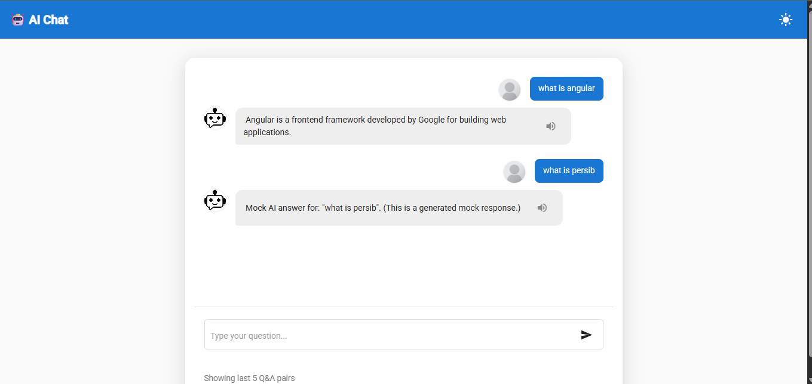
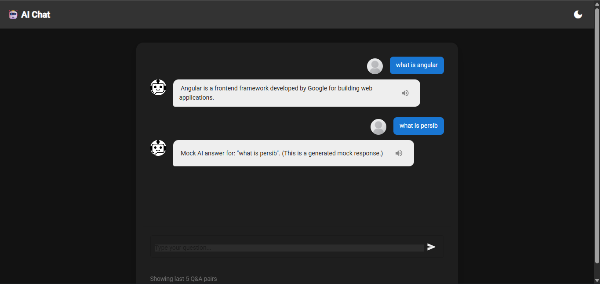

# 🤖 Angular AI Chat App

An elegant **AI-powered chat interface** built with **Angular**, featuring smooth animations, dark mode, AI voice replies, and real-time chat experience.
Perfect for learning how to integrate AI models (like OpenAI or custom APIs) into a modern Angular UI.

---

## ✨ Features

* 🎨 **Modern UI** — Clean chat bubble design with dark & light mode support
* 🌙 **Dark Mode Toggle** — Seamlessly switch between light and dark themes
* 🗣️ **AI Voice Replies** — Uses **Web Speech API** for AI voice output
* ⌨️ **Subtitle Typing Animation** — Realistic typing effect for AI messages
* ⚡ **Real-time AI Integration Ready** — Easily connect with OpenAI API or your own backend
* 📜 **Custom Scrollbar** — Beautiful smooth scrollbar design
* 🧠 **Fully Modular Structure** — Easy to extend and maintain

---

## 🧩 Tech Stack

* **Angular 18+**
* **TypeScript**
* **Angular Material**
* **Web Speech API**
* **SCSS** for custom styling

---

## 🚀 Getting Started

### 1️⃣ Clone the Repository

```bash
git clone https://github.com/raflymaulana28/angular-ai-chat.git
cd angular-ai-chat
```

### 2️⃣ Install Dependencies

```bash
npm install
```

### 3️⃣ Run the App

```bash
ng serve
```
or

```bash
npm start
```

Open your browser and navigate to
👉 **[http://localhost:4200](http://localhost:4200)**

---

## ⚙️ Project Structure

```
src/
 ├─ app/
 │   ├─ features/
 │   │   └─ chat/
 │   │       ├─ chat.component.ts
 │   │       ├─ chat.component.html
 │   │       ├─ chat.component.scss
 │   │       └─ chat.service.ts
 │   └─ core/
 │       ├─ theme.service.ts      # Handles dark/light mode
 │       └─ ai.service.ts         # For integrating AI API
 ├─ assets/
 │   └─ ai-avatar.png
 └─ styles.scss                   # Global styling and scrollbar theme
```

---


## 🔊 AI Voice Replies

This feature uses the **Web Speech API**, available for free in most browsers.

```typescript
speak(text: string) {
  const utterance = new SpeechSynthesisUtterance(text);
  utterance.lang = 'en-US';
  speechSynthesis.speak(utterance);
}
```

✅ Works offline (depending on browser)
⚠️ Chrome / Edge recommended for best results

---

## 💡 Future Enhancements

* 🔁 Real-time streaming AI responses (via WebSocket or Server-Sent Events)
* 📱 PWA support for mobile
* 🌐 Multi-language voice synthesis
* 🧩 Plugin support (images, code blocks, etc.)

---

## 📸 Screenshots

| Light Mode                                 | Dark Mode                                |
| ------------------------------------------ | ---------------------------------------- |
|  |  |

---

## 👨‍💻 Author

**Rafly Maulana**
Frontend Developer • React | Angular | Next.js | TypeScript
🌍 Bandung, Indonesia

🔗 [LinkedIn](https://www.linkedin.com/in/raflymaulana28) • [GitHub](https://github.com/raflymaulana28) • [Portfolio](https://raflymaulana-site.vercel.app)

---

## 📝 License

This project is licensed under the **MIT License**.
Feel free to use and modify it for personal or commercial projects.

---